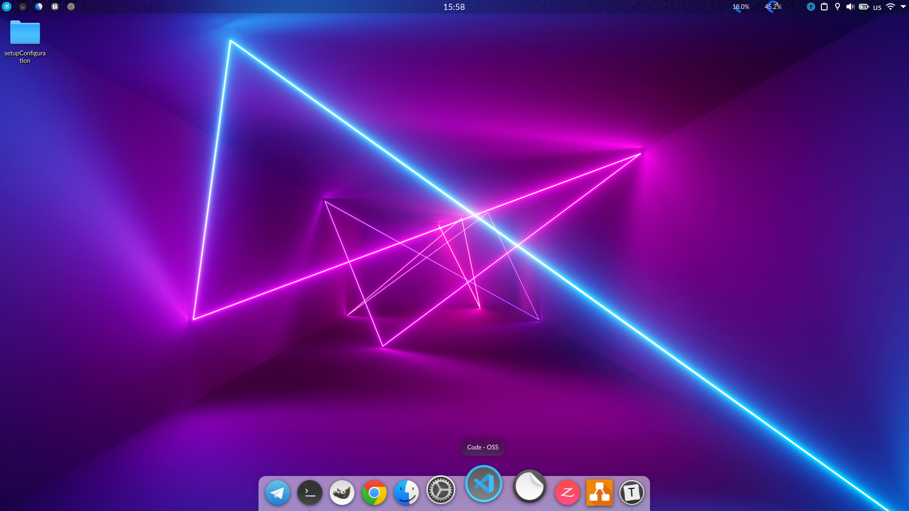
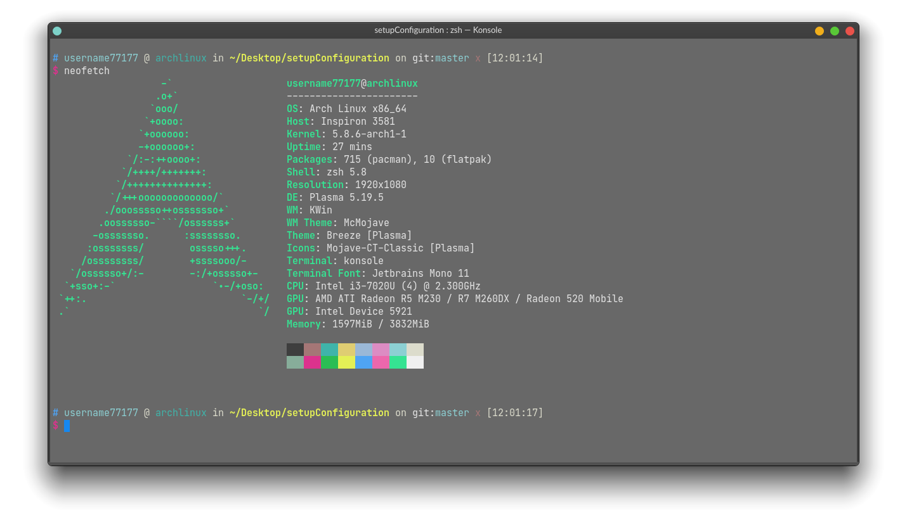

# Дотфайлы

<div align="center">

</div>

Дотфайлы - конфигурации для Linux-утилит и программ. Дотфайлами они называются потому что в Unix-подобных системах все файлы начинающиеся с `.` - скрыты (dotfiles).

# Основная конфигурация

## Общая конфигурация

Общая конфигурация в основном касается консоли.

Включены конфигурации следующих утилит:

* Neofetch
* Neovim
* Ranger
* Mocp
* Konsole
* htop

## KDE

<div align="center">

</div>


<div align="center">

</div>


* Шрифты: *JetBrains Mono*, *Lato*

* Иконки: McMojave-Circle-Blue
* Цвета и детализация окон: McMojave
* Цветовая палитра консоли: us3rn4me-colorscheme

* Панель: LatteDock (с моей схемой)

Все конфигурационные файлы, которые относятся к сборке **KDE**:

* config/lattedockrc
* config/albert
* config/Typora

## Подготовка к установке dotfile'ов

```bash
sudo pacman -Sy neofetch htop neovim latte-dock plasma \
ttf-lato ttf-jetbrains-mono konsole dolphin spectacle  \
base-devel albert flatpak
```

```bash
# Часть с yay
yay -Sy google-chrome typora
```

## TheGreatestBSPWM

<div align="center">

</div>

## Содержание
* Installing
	* Full Installing
	* Colorschemes
	* Packages
	* Optional Dependecies
* Differences from another rices
* Let's get started
* Configurations and list of programs


#### Пакеты (зависимости)

| Пакет | Для чего нужен |
|-------|----------------|
| bspwm | Оконный менеджер |
| sxhkd | Хоткеи |
| rofi | Утилита для запуска приложений |
| dunst | Уведомления |
| xautolock | Автоблокировка |
| lightdm-webkit2-greeter | Менеджер DE |
| picom | Композитор |
| udiskie | Утилита для монтирования USB автоматически |
| pavucontrol | Утилита для настройки звука |
| feh | Программа для просмотра изображений (не по дефолту, из-за неудобства), а также утилита для установки обоев |
| sxiv | Программа для просмотра изображений |
| redshift | Мягкий свет ночью |
| kitty | Терминал |
| vim | Редактор
| ttf-jetbrains-mono | Шрифт |
| ttf-lato | Шрифт |
| fzf | Быстрый поиск |
| scrot | Скриншоты |
| ttf-font-awesome | Иконки |
| imagemagick | Утилита для обработки фотографий. Нужна для скриншотов |
| nautilus | Файловый менеджер |
| alsa-lib | Библиотеки ALSA |
| alsa-utils | Предоставляет amixer, с помощью которого можно быстро менять громкость |

###### Дополнительные зависимости
| Пакет | Для чего нужен пакет |
|-------|----------------------|
| ffmpeg | Запись видео        |
| ranger | Дополнительный файловый менеджер |
| vlc | Утилита для просмотра видео |
| materia-gtk-theme | Тема для приложений GTK |
| pulseaudio | Программа для расширенной работы со звуком |
| pulseaudio-alsa | Мост для ALSA |
| pulseaudio-bluetooth | Плагин для Bluetooth устройств |
| telegram-desktop | Приложение для общения |

## Основные отличия от других "райсов"

[Trello Board](https://trello.com/b/pwlTN4uX/thegreatestbspwm)

Данную сборку я делал для постоянного использования. Целей было поставленно много, однако в целом философию "TheGreatestBSPWM" можно объединить в одно простое "гибкость и кастомизация".
Вы можете использовать сборку как угодно, переход между плавающими окнами (по умолчанию) и расширенными (tiled) осуществляется с помощью нажатия `Win + f` или `Win + i` (для всех окон). В сборке намешанно много всего, однако целью данного Readme является помощь вам в освоении всего, что включает TheGreatestBSPWM.

> Я не затрагиваю настройку загрузчиков и систем управления сред рабочего стола, потому что они могут негативно сказаться на работоспособности ПК. Если нужно, то я думаю на Github можно будет оставить issue и я скину настройки GRUB и lightdm

#### Комбинации клавиш
Здесь всё хорошо. Существует одно простое правило, которое представленно ниже:
| Кнопка | Значение |
|--------|----------|
| Super (WIN) | Системные приложения |
| Alt | Предпросмотр будущих окон (расположение относительно текущего окна в расширенном (tiled) состоянии |
| Ctrl | Размер окон |
| Shift | Перемещение окон |
| Alt + одна из букв названия программы | Запуск приложения |


| Кнопка | Значение |
|--------|----------|
| Super + **ctrl** + {h,j,k,l} | Расширить окно в одну из сторон |
| Super + **ctrl** + {y,u,i,o} | Уменьшить окно в одной из сторон |
| Super + **ctrl** + = | Сделать окна равносторонними |


## С чего начать?
Вы можете выполнить скрипт `install.sh`, который уже был отмечен вверху. После его выполнения вам нужно сделать ещё несколько действий:
* Найти обои (можно множество, TheGreatestBSPWM будет выбирать случайные при каждом запуске) и кинуть их в `$HOME/.wallpapers`
* Скачать `Google-chrome-stable` и `polybar`, так как именно под них заточенно большинство программ. Скачать их можно из AUR с помощью команды
	```bash
	yay -Sy google-chrome
	yay -Sy polybar
	```
> Google Chrome обеспечивает более новые веб-стандарты, а также в нём удобные инструменты разработчика. Мне как веб-разработчику он удобен. Если найдутся те, кто не разделяют моего мнения, то просто форкайте репозиторий и сбрасывайте мне конфиги, где всё настроенно под Firefox. С радостью создам ещё одну ветку.
* Если вы работаете с Vim, то советую вам [скачать конфигурации под Vim](https://github.com/us3rn4me-profile/GreatVim) (требуется vim-plug). В райс входит базовая конфигурация vimrc (форк с вышеупомянутого резпозитория)

## Конфигурация и список программ
#### bspwm
Я перепробовал много оконных менеджеров, и остановился на BSPWM. Он быстрый, удобный,  его конфигурация - скрипт. С ним можно совмещать огромное количество программ и утилит. Конфигурация данного менеджера не составляет большого труда. В скрипте мы просто прописываем команды, которые потом посылаются самому оконному менеджеру. Всё, что находится в ~/.config/bspwm/ хорошо задокументировано.

> Файл конфигурации находится в ~/.config/bspwm/

#### sxhkd
sxhkd является основным менеджером хоткеев. Весь его конфигурационный файл является чередованием комбинации клавиш и команд которые потом будут исполняться из шелла.

> Файл конфигурации находится в ~/.config/sxhkd/

#### Polybar
Polybar - основная панель состояния, которая будет показывать: время, нагрузку процессора, громкость, заполненность памяти, качество соединения, заряд батареи, а также температуру процессора.

> Файл конфигурации находится в ~/.config/polybar/

#### rofi
Rofi - приложение для запуска приложений. Является очень удобным, так как его можно настраивать как угодно.
Он может принимать входные значения, выводить их на экран в виде меню, а затем возвращать выбранное значение.

> Файл конфигурации находится в ~/.config/rofi/

#### zsh + oh-my-zsh
Мой основной шелл. Zsh сам по себе уже удобен, а с oh-my-zsh он становится еще и крайне гибким.
zshrc автоматически скачает oh-my-zsh, если его нет на ПК.

> Файл конфигурации находится в ~/.zshrc

#### dunst
Менеджер уведомлений. Легковесный, быстрый, кастомизируемый. Использует только дневную тему.
> Файл конфигурации находится в ~/.config/dunst/

#### picom
Композитор (программа для отображения теней, плавных переходов и прочего.

> Файл конфигурации находится в ~/.config/picom.conf
> Также существует версия конфигурации для ветки (*picom-next*), в которой есть блюр, закругленные углы у окон и прочее.

#### redshift
Я беспокоюсь о здоровье глаз, поэтому предпочитаю чтобы ночью экран был чуть "теплее". Именно это Redshift и делает.
По умолчанию задана длина и широта: Москва, Россия
> Файл конфигурации находится в ~/.config/redshift.conf

#### zathura
Ридер по умолчанию для pdf, djvu, cb.
Легковесный, мощный, быстрый.
> Файл конфигурации находится в ~/.config/zathura/

#### Шрифты и иконки
**Шрифты:**
* **JetBrains Mono** - моношмринный
* **Lato** - Обычный
* **Roboto** - Обычный (альтернатива)
* **Awesome Font** - иконки

**Иконки:**
* [Mojave CT Icons Classic](https://store.kde.org/p/1210856/)

#### Кастомные скрипты
Все кастомные скрипты расположены в конфигурационных папках программ, к которым они относятся.
